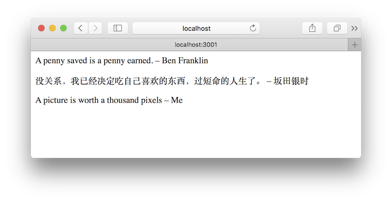
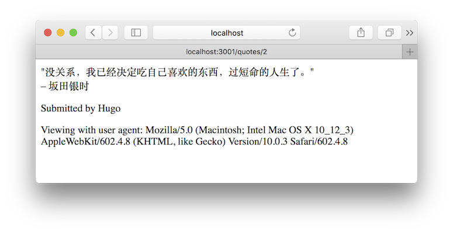

Rebuilding Rails
================

- Why: Build a Rails-like framework
- Book: [Rebuilding Rails](https://rebuilding-rails.com/)
- Ruby: 2.3

## Screenshots

### Homepage

### Show page

### Subapp

## Some other Ruby frameworks worth exploring

- [Sinatra](https://github.com/sinatra/sinatra): Classy web-development dressed in a DSL.
- [Nancy](https://github.com/guilleiguaran/nancy): Minimal Ruby microframework for web development inspired in Sinatra and Cuba.
- [Hobbit](https://github.com/patriciomacadden/hobbit): A minimalistic microframework built on top of Rack.
- [Cuba](https://github.com/soveran/cuba): [Rum](https://github.com/chneukirchen/rum) based microframework for web development.
- [Busker](https://github.com/pachacamac/busker):An extremely simple web framework.
- [Brooklyn](https://github.com/luislavena/brooklyn): Small web tool on top of Rack.
- [Thin](https://github.com/macournoyer/thin): A very fast & simple Ruby web server.
- [Scorched](https://github.com/Wardrop/Scorched): Light-weight, DRY as a desert, web framework for Ruby.
- [New York, New York(NYNY)](https://github.com/alisnic/nyny): A (ridiculously) small and powerful web framework.
- [Midori](https://github.com/heckpsi-lab/em-midori): Lightweight, Flexible and Fast Ruby Web Framework.
